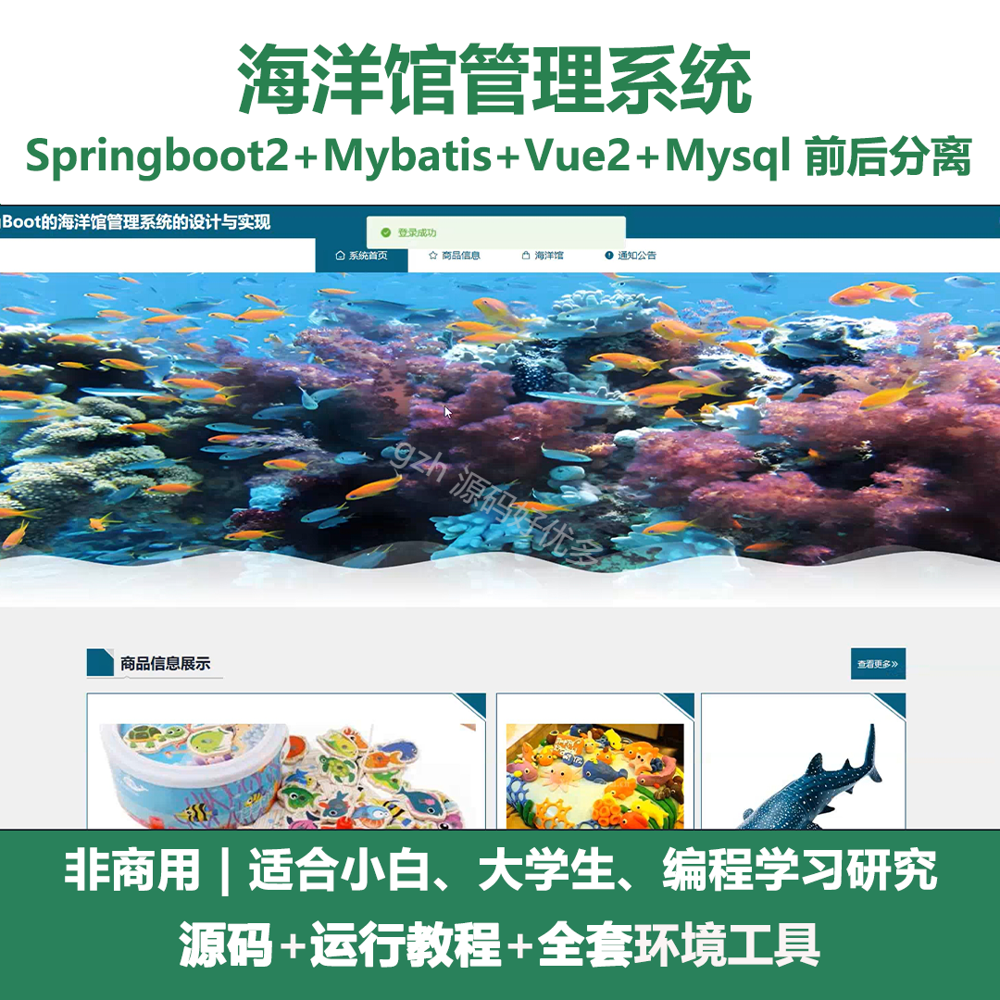
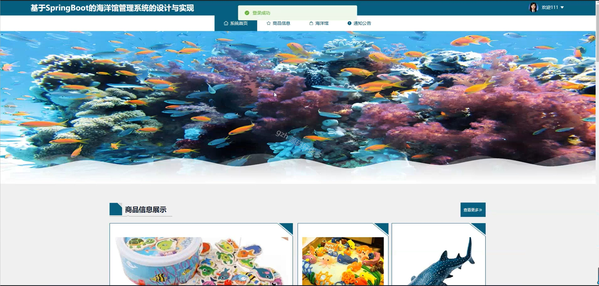
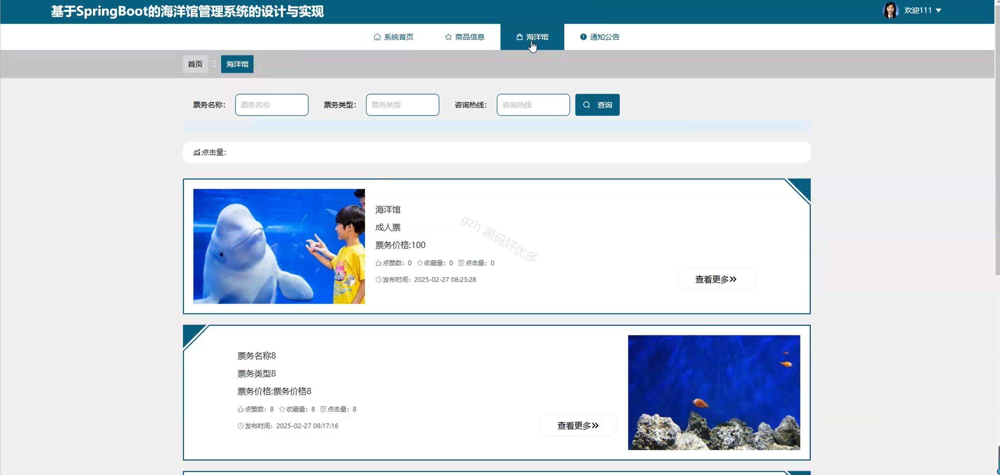
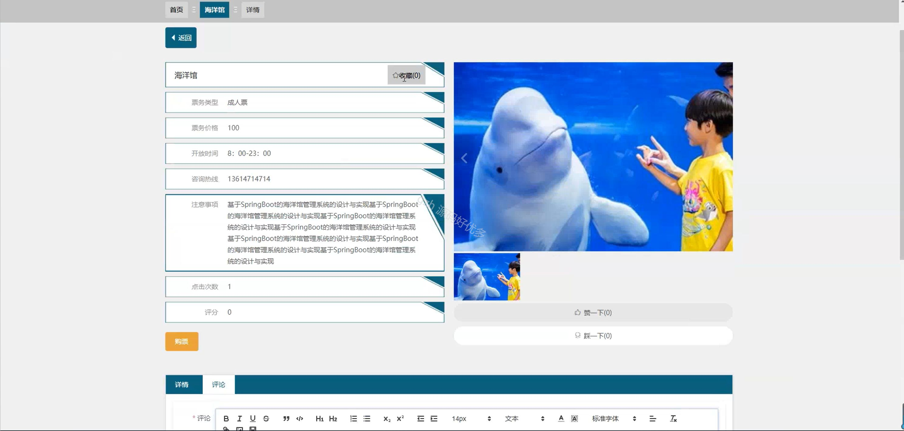
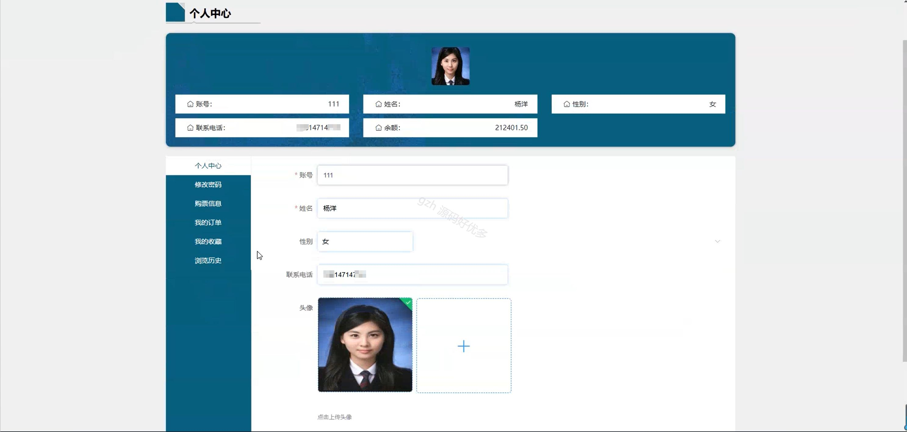
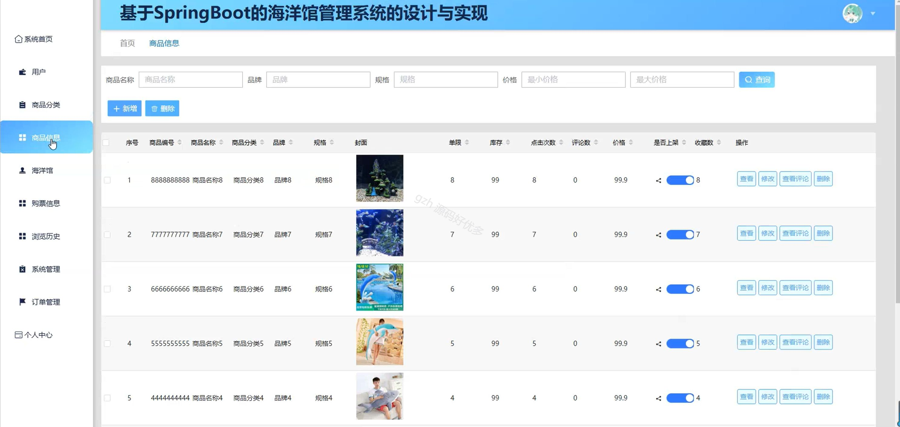
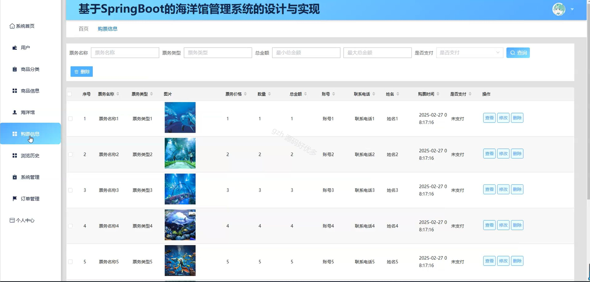
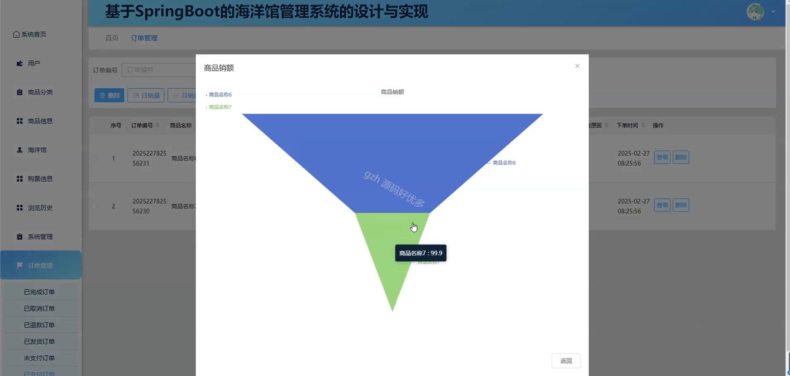
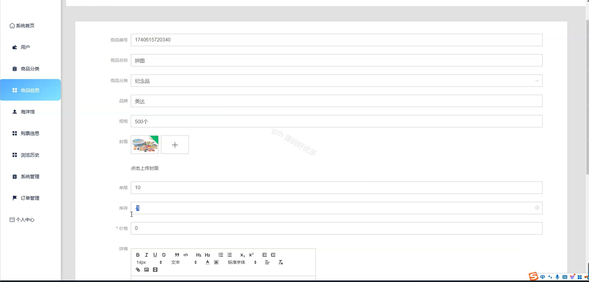

# springbootA274D
springbootA274D海洋馆管理系统
 
## 查看主页获取源码

### 一、关键词
海洋馆商品信息、海洋馆订单管理、海洋馆购票信息

### 二、作品包含
源码+数据库+全套环境和工具资源+本地部署教程

### 三、项目技术
前端技术：Html、Css、Js、Vue2.0、Element-ui 
后端技术：Java、SpringBoot2.0、MyBatis

### 四、运行环境（以下版本亲测，其他版本未知，请自测）
开发工具：IDEA/eclipse  + VSCODE

数据库：MySQL5.7（最低要5.7版本）

数据库管理工具：Navicat10以上版本

环境配置软件： JDK1.8 + Maven3.6.3

前端Nodejs：14

浏览器：谷歌浏览器

### 五、项目介绍
项目编号：springbootA274D

海洋馆管理系统可对海洋馆的用户、商品、订单等多方面进行综合管理，助力运营高效有序。

角色：管理员、用户

管理员：系统首页、用户、商品分类、商品信息、海洋馆、购票信息、浏览历史、系统管理、订单管理、个人中心。

用户：系统首页、商品信息、海洋馆、通知公告、个人中心、修改密码、购票信息、我的订单、我的收藏、浏览历史。

### 六、运行截图

